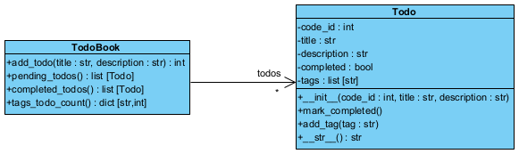

# Libreta de tareas pendientes (ToDo)
Esta es una aplicación de práctica de conceptos de programación 
orientada a objetos en python, en la cual se quiere implementar una 
libreta de tareas pendientes. El modelo del mundo del problema para dicha
aplicación es el siguiente:

El código de la aplicación se encuentra incompleto, la idea es completarlo
teniendo en cuenta los siguientes pasos.

1. En el módulo **todo.py**, cree una clase `Todo` que tenga los siguientes 
atributos: `code_id (int)`, `title (str)`, `description (str)`, `completed (bool)`,
`tags (list[str])`. En el método inicializador reciba los parámetros `code_id`,
`title` y `description` para inicializar los atributos correspondientes.
El atributo `completed` inicialícelo en `False` y el atributo `tags` inicialícelo
como una lista vacía. 
2. En la clase `Todo`, defina un método de instancia `mark_completed` en el 
cual se cambia el valor del atributo `completed` a `True`. 
3. En la clase `Todo` defina un método `add_tag` que recibe como parámetro 
un string `tag`. En el método debe verificar si el `tag` no se encuentra en la lista `tags`, entonces
lo debe agregar. 
4. En la clase `Todo`, defina el método especial `__str__` que retorna un string.
Este método debe retornar un string que contenga el código del todo y el
título, de la siguiente forma "code_id - title".
5. En el módulo **todo.py**, cree una clase `TodoBook` la cual tiene un atributo
`todos` que es un diccionario donde la clave son enteros y los valores son objetos
de la clase `Todo`. En el método inicializador, inicialice el atributo `todos` como
un diccionario vacío.
6. En la clase `TodoBook`, defina un método de instancia `add_todo` que recibe los 
parámetros `title (str)` y `description (str)` y retorna un valor de tipo `int`.
En el cuerpo del método implemente el código necesario para hacer lo siguiente:
   - Generar un id que sea igual al número de elementos en el diccionario `todos` más uno.
   - Crear un objeto de la clase `Todo`.
   - Agregar el objeto de la clase `Todo` al diccionario utilizando como clave el id generado.
   - Retornar el id
7. En la clase `TodoBook`, defina un método de instancia `pending_todos` que retorne
una lista de objetos de la clase `Todo`. En el cuerpo del método, utilice un
*list comprehension* para crear una lista con todos los objetos del diccionario `todos` que
tienen el atributo `completed` con valor `False`.
8. En la clase `TodoBook`, defina un método de instancia `completed_todos` que retorne
una lista de objetos de la clase `Todo`. En el cuerpo del método, utilice un
*list comprehension* para crear una lista con todos los objetos del diccionario `todos` que
tienen el atributo `completed` con valor `True`.
9. En la clase `TodoBook`, defina un método de instancia `tags_todo_count` el cual retorna
un diccionario donde las claves son string y los valores enteros. En el cuerpo del método
implemente un algoritmo para construir un diccionario que indique, por cada tag, cuántos objetos
Todo tienen dicho tag asignado.

**Nota**: Debe utilizar pistas de tipos en todos los casos donde sea posible.
